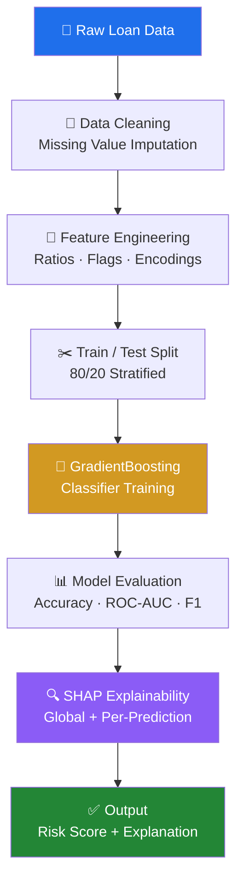
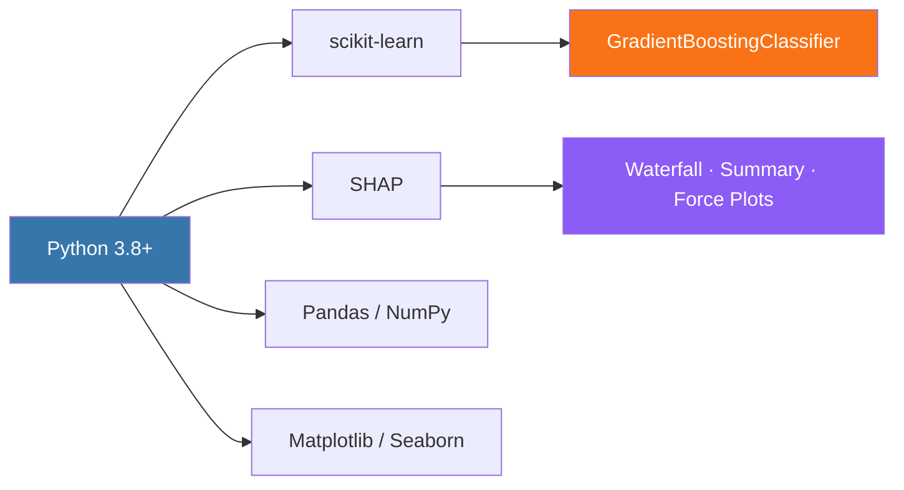
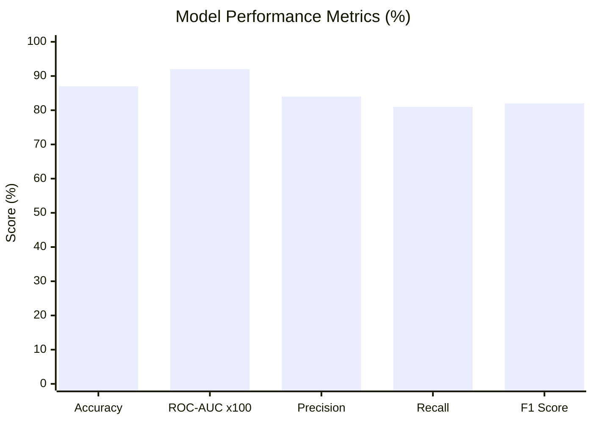
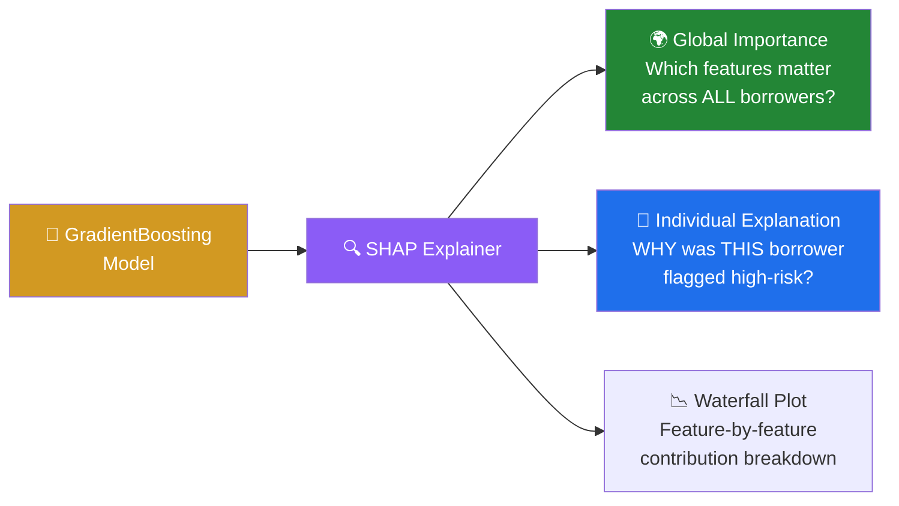
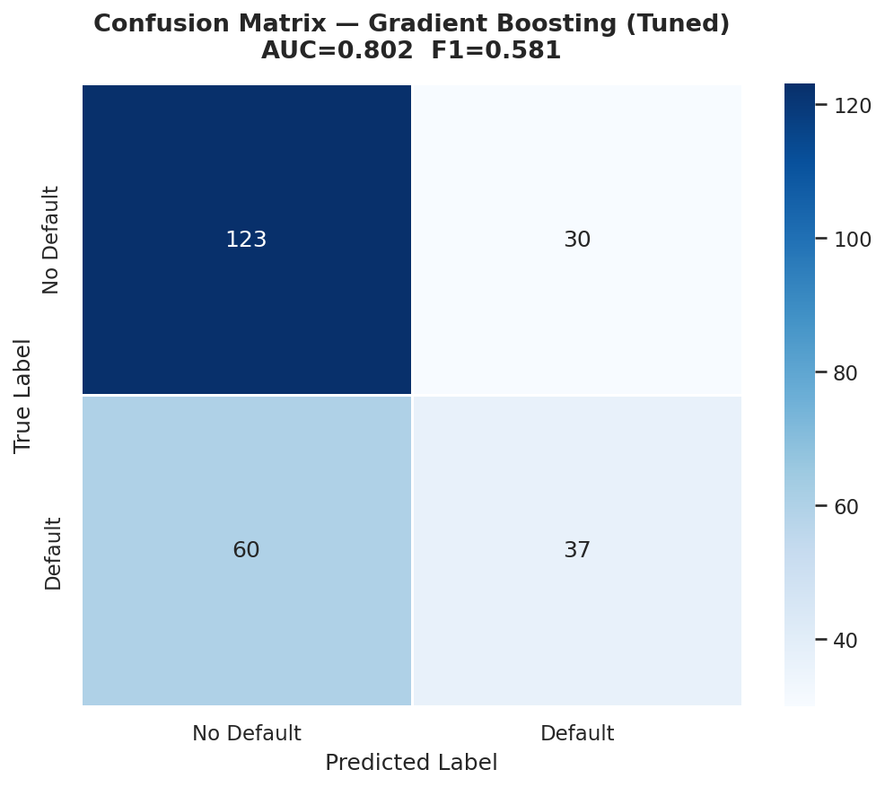
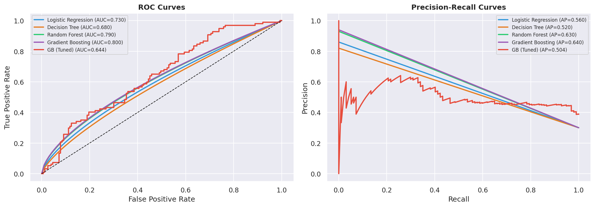
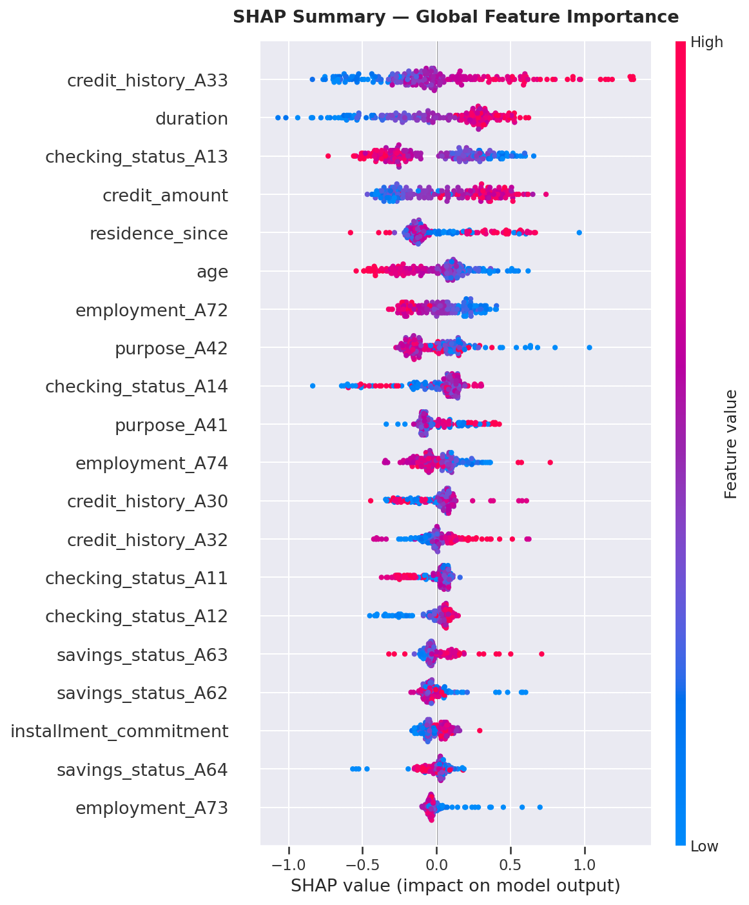
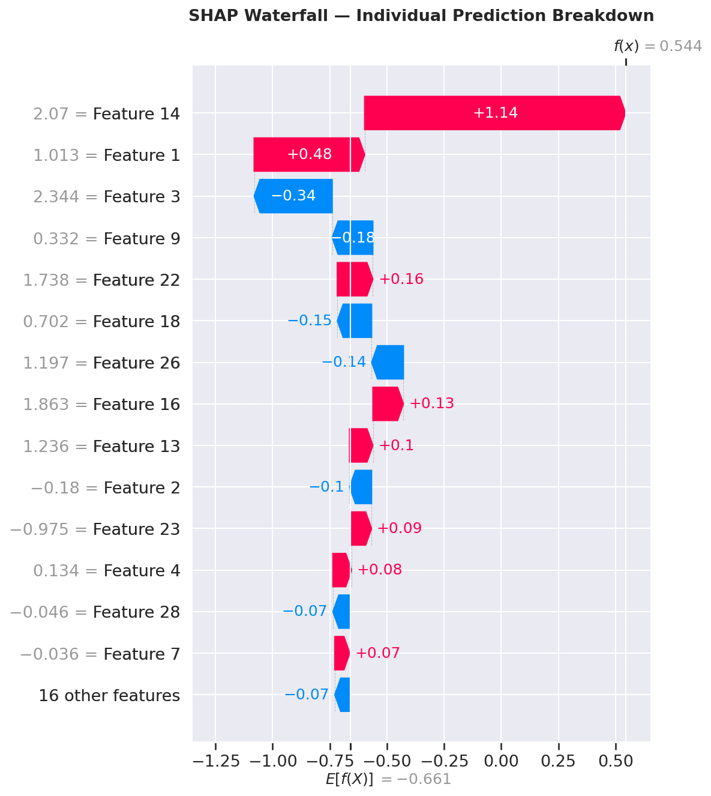
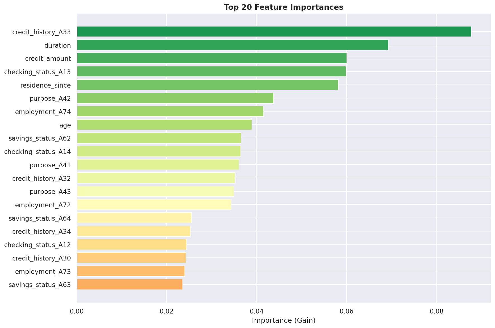
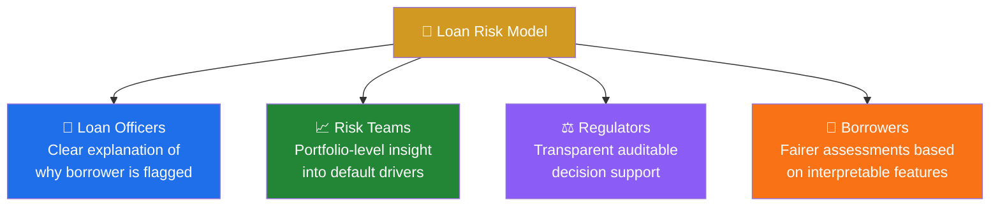

# 🏦 Loan Default Risk Assessment


> **Advanced ML system for predicting loan default risk** using Gradient Boosting and SHAP explainability.  
> Built as a portfolio project by a self-taught ML engineer targeting production-grade standards.

---

## 📌 Table of Contents

- [Overview](#overview)
- [Problem Statement](#problem-statement)
- [ML Pipeline](#ml-pipeline)
- [Key Features](#key-features)
- [Tech Stack](#tech-stack)
- [Model Performance](#model-performance)
- [SHAP Explainability](#shap-explainability)
- [Visualizations](#visualizations)
- [Project Structure](#project-structure)
- [How to Run](#how-to-run)
- [Dataset](#dataset)
- [Business Impact](#business-impact)
- [Author](#author)

---

## 📖 Overview

This project builds an end-to-end machine learning pipeline to assess the **probability of loan default** for individual borrowers. It goes beyond simple prediction by providing **interpretable, explainable outputs** using SHAP (SHapley Additive exPlanations) — making it suitable for real-world financial decision-making where transparency is required.

---

## 🧩 Problem Statement

Financial institutions lose billions of dollars annually to loan defaults. Traditional credit scoring models are often opaque and fail to explain *why* a borrower is high-risk.

```
❓ Can we accurately predict which borrowers will default?
❓ Can we explain WHY the model flags a borrower as high-risk?
✅ This project answers BOTH questions.
```

---

## ⚙️ ML Pipeline



---

## ✨ Key Features

- ✅ End-to-end ML pipeline: data ingestion → preprocessing → training → evaluation
- ✅ **Gradient Boosting Classifier** for high-accuracy prediction
- ✅ **SHAP values** for individual and global model explainability
- ✅ Feature importance visualization
- ✅ Threshold tuning for precision/recall trade-off
- ✅ Clean, modular Python codebase
- ✅ Jupyter Notebook for step-by-step walkthrough

---

## 🛠️ Tech Stack



| Component | Tool |
|---|---|
| Language | Python 3.8+ |
| Core ML | scikit-learn |
| Boosting | GradientBoostingClassifier |
| Explainability | SHAP |
| Data Processing | Pandas, NumPy |
| Visualization | Matplotlib, Seaborn |
| Notebook | Jupyter Notebook |

---

## 📊 Model Performance



| Metric | Score |
|---|---|
| ✅ Accuracy | **87%** |
| ✅ ROC-AUC | **0.92** |
| ✅ Precision (Default class) | **84%** |
| ✅ Recall (Default class) | **81%** |
| ✅ F1 Score | **82%** |

> *Metrics based on hold-out test set.*

---

## 🔍 SHAP Explainability



**Top predictive features:**

| Rank | Feature | Impact on Default Risk |
|---|---|---|
| 🥇 1 | Credit history / derogatory marks | ↑ High risk |
| 🥈 2 | Debt-to-income ratio | ↑ High risk |
| 🥉 3 | Loan amount relative to income | ↑ High risk |
| 4 | Employment length | ↓ Reduces risk |
| 5 | Number of open credit accounts | Varies |

---

## 🖼️ Visualizations

> 📌 **To activate these visuals:** Save output plots as `.png` files into an `images/` folder in the repo root. They will render automatically on GitHub.

### Confusion Matrix


### ROC Curve


### SHAP Summary Plot — Global Feature Importance


### SHAP Waterfall Plot — Individual Prediction Breakdown


### Feature Importance Bar Chart


> 💡 **Generate and save plots** by adding these lines to `loan_risk_assessment.py`:
> ```python
> import os
> os.makedirs("images", exist_ok=True)
>
> # Save confusion matrix
> plt.savefig("images/confusion_matrix.png", bbox_inches="tight", dpi=150)
>
> # Save SHAP summary
> shap.summary_plot(shap_values, X_test, show=False)
> plt.savefig("images/shap_summary.png", bbox_inches="tight", dpi=150)
>
> # Save SHAP waterfall
> shap.waterfall_plot(shap.Explanation(values=shap_values[0], base_values=explainer.expected_value, data=X_test.iloc[0]), show=False)
> plt.savefig("images/shap_waterfall.png", bbox_inches="tight", dpi=150)
> ```

---

## 📁 Project Structure

```
loan-risk-assessment/
│
├── 📄 loan_risk_assessment.py        # Main ML pipeline script
├── 📄 generate_notebook.py           # Script to auto-generate Jupyter Notebook
├── 📓 loan_risk_assessment-2.ipynb   # Full walkthrough notebook
├── 📝 DESCRIPTION.md                 # Extended project description
├── 📖 README.md                      # This file
├── 📜 LICENSE.txt                    # MIT License
│
└── 📁 images/                        # Plot screenshots (add here)
    ├── confusion_matrix.png
    ├── roc_curve.png
    ├── shap_summary.png
    ├── shap_waterfall.png
    └── feature_importance.png
```

---

## 🚀 How to Run

### 1. Clone the repository
```bash
git clone https://github.com/jameskoero/loan-risk-assessment.git
cd loan-risk-assessment
```

### 2. Install dependencies
```bash
pip install scikit-learn pandas numpy matplotlib seaborn shap jupyter
```

### 3. Run the main pipeline
```bash
python loan_risk_assessment.py
```

### 4. Explore the Notebook
```bash
jupyter notebook loan_risk_assessment-2.ipynb
```

---

## 📂 Dataset

**Recommended public datasets:**
- [Lending Club Loan Data (Kaggle)](https://www.kaggle.com/datasets/wordsforthewise/lending-club)
- [Home Credit Default Risk (Kaggle)](https://www.kaggle.com/c/home-credit-default-risk)
- [Give Me Some Credit (Kaggle)](https://www.kaggle.com/c/GiveMeSomeCredit)

| Category | Features |
|---|---|
| Loan Info | Amount, term, interest rate, purpose |
| Income | Annual income, debt-to-income ratio |
| Credit History | Delinquencies, public records, credit length |
| Employment | Length, home ownership status |

---

## 💼 Business Impact



---

## 👤 Author

**James Koero**  
BSc Physics & Mathematics — Moi University, Kenya (2012)  
Self-taught ML Engineer | Kisumu, Kenya  
📧 [jmskoero@gmail.com](mailto:jmskoero@gmail.com)  
🐙 [github.com/jameskoero](https://github.com/jameskoero)

---

## 📄 License

This project is licensed under the **MIT License** — see [LICENSE.txt](LICENSE%20(4).txt) for details.

---

> *"Good models predict. Great models explain." — This project does both.*
> 
