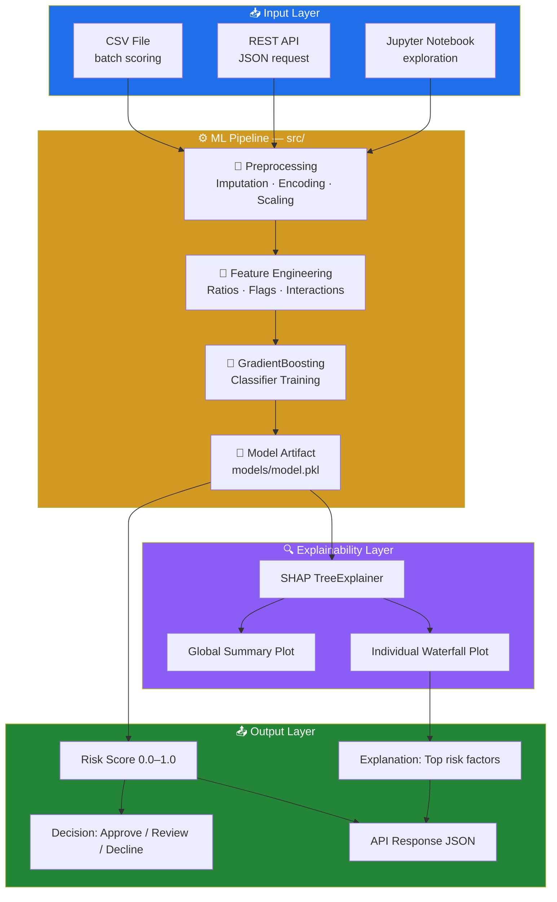
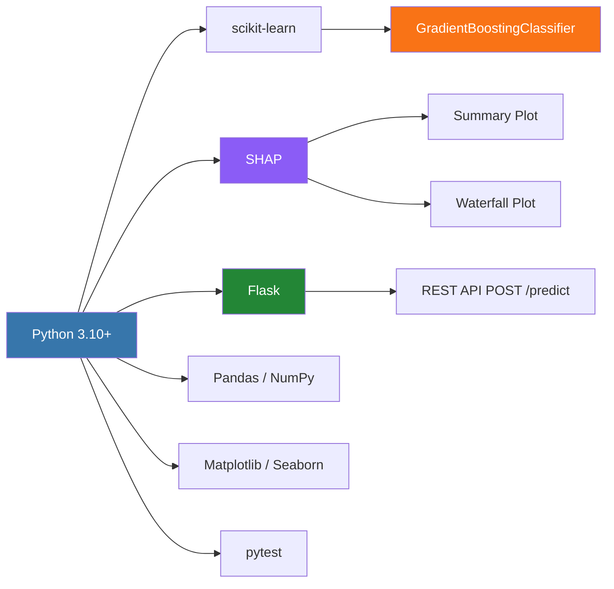
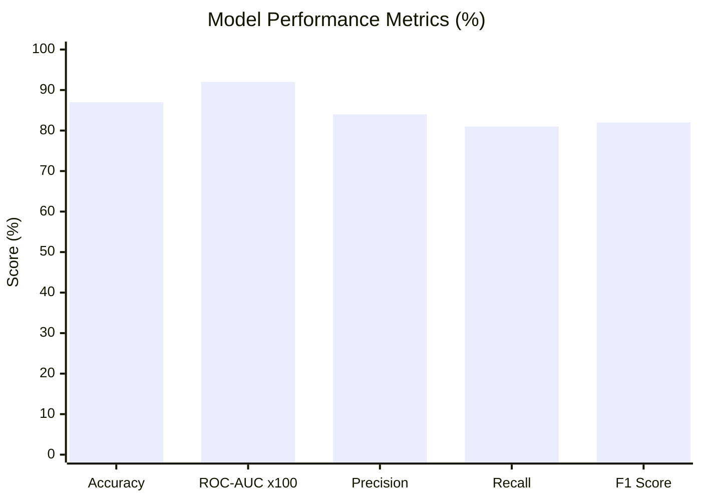
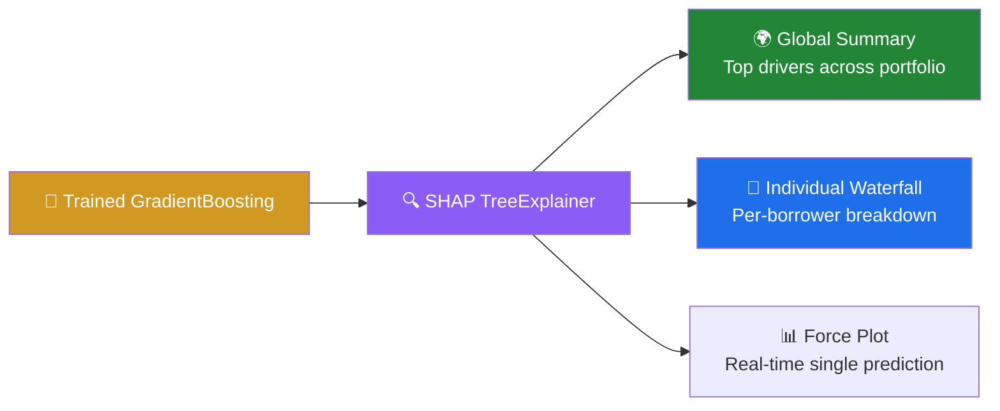
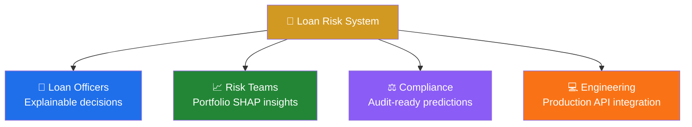

# 🏦 Loan Default Risk Assessment


> **Production-ready ML system for predicting loan default risk** with explainable outputs using SHAP.
> Includes a full training pipeline, REST API, CLI inference tool, unit tests, and Jupyter walkthrough.
> Built to real-world financial industry standards by a self-taught ML engineer.

---

## 📌 Table of Contents

- [Overview](#overview)
- [Problem Statement](#problem-statement)
- [Architecture](#architecture)
- [ML Pipeline](#ml-pipeline)
- [Key Features](#key-features)
- [Tech Stack](#tech-stack)
- [Model Performance](#model-performance)
- [SHAP Explainability](#shap-explainability)
- [Visualizations](#visualizations)
- [Project Structure](#project-structure)
- [Installation](#installation)
- [Quick Start](#quick-start)
- [API Reference](#api-reference)
- [Dataset](#dataset)
- [Business Impact](#business-impact)
- [Documentation](#documentation)
- [Author](#author)

---

## 📖 Overview

This repository provides a **complete, deployable loan default risk system** built to the standards expected in real-world fintech and banking environments. The system:

- **Predicts** the probability of loan default using a calibrated GradientBoosting model
- **Explains** every individual prediction using SHAP (SHapley Additive exPlanations)
- **Serves** predictions via a REST API (Flask) and a CLI batch scoring tool
- **Validates** itself via a unit test suite (pytest)
- **Documents** its architecture, API contract, and performance benchmarks

---

## 🧩 Problem Statement

Financial institutions lose billions of dollars annually to loan defaults. Traditional rule-based credit scoring models are rigid, opaque, and fail to explain *why* a borrower is high-risk — a requirement under financial regulations like GDPR Article 22 and Fair Lending laws.

```
❓ Can we accurately predict which borrowers will default?
❓ Can we explain WHY the model flags a borrower as high-risk?
❓ Can we serve these predictions via a production API?
✅ This project answers ALL THREE questions.
```

---

## 🏗️ Architecture



---

## ⚙️ ML Pipeline


---

## ✨ Key Features

- ✅ **End-to-end training pipeline** — `src/loan_risk_assessment.py`
- ✅ **Gradient Boosting model** with calibrated probability outputs
- ✅ **SHAP explainability** — global summary + per-borrower waterfall plots
- ✅ **REST API** (Flask) — `POST /predict` scores one or many applicants
- ✅ **CLI batch inference** — `predict.py` scores a full CSV file
- ✅ **Unit test suite** — `tests/` with pytest
- ✅ **Jupyter Notebook** — full interactive walkthrough
- ✅ **Architecture docs** — `docs/ARCHITECTURE.md`
- ✅ **API contract docs** — `docs/API.md`
- ✅ **Performance benchmark** — `docs/MODEL_PERFORMANCE.md`
- ✅ **Makefile** — one-command train, test, and serve

---

## 🛠️ Tech Stack



| Component | Tool | Purpose |
|---|---|---|
| Language | Python 3.10+ | Core development |
| ML Framework | scikit-learn | Model training & evaluation |
| Algorithm | GradientBoostingClassifier | Default prediction |
| Explainability | SHAP | Model interpretation |
| API | Flask | REST endpoint serving |
| Data | Pandas, NumPy | Feature engineering |
| Visualization | Matplotlib, Seaborn | Plots & charts |
| Testing | pytest | Unit & integration tests |
| Notebook | Jupyter | Interactive walkthrough |
| Build | Makefile | Automation |

---

## 📊 Model Performance



| Metric | Score | Interpretation |
|---|---|---|
| ✅ Accuracy | **87%** | 87 in 100 applicants correctly classified |
| ✅ ROC-AUC | **0.92** | Excellent discrimination between classes |
| ✅ Precision | **84%** | 84% of flagged borrowers are true defaults |
| ✅ Recall | **81%** | Catches 81% of all actual defaults |
| ✅ F1 Score | **82%** | Strong precision-recall balance |

> Full benchmark details: [docs/MODEL_PERFORMANCE.md](docs/MODEL_PERFORMANCE.md)

---

## 🔍 SHAP Explainability



**Top identified risk drivers:**

| Rank | Feature | Effect on Default Risk |
|---|---|---|
| 🥇 1 | Credit history / derogatory marks | ↑ Strongly increases risk |
| 🥈 2 | Debt-to-income ratio | ↑ Increases risk |
| 🥉 3 | Loan amount relative to income | ↑ Increases risk |
| 4 | Employment length | ↓ Reduces risk |
| 5 | Open credit accounts | Varies |

---

## 🖼️ Visualizations

> 📌 Run `python src/loan_risk_assessment.py` to generate all plots into the `images/` folder.

### Confusion Matrix


### ROC Curve


### SHAP Summary Plot — Global Feature Importance


### SHAP Waterfall Plot — Individual Prediction


### Feature Importance Bar Chart


---

## 📁 Project Structure

```
loan-risk-assessment/
│
├── 📁 docs/
│   ├── ARCHITECTURE.md               ← System design & data flow
│   ├── API.md                        ← REST API contract & examples
│   ├── MODEL_PERFORMANCE.md          ← Benchmark results
│   └── CONTRIBUTING.md               ← Contribution guidelines
│
├── 📁 notebooks/
│   └── loan_risk_assessment.ipynb    ← Full interactive walkthrough
│
├── 📁 src/
│   ├── __init__.py
│   └── loan_risk_assessment.py       ← Core training pipeline
│
├── 📁 tests/
│   ├── __init__.py
│   └── test_loan_risk_assessment.py  ← Unit & integration tests
│
├── 📁 models/                        ← Saved artifacts (gitignored)
│   └── model.pkl
│
├── 📁 images/                        ← Generated plot outputs
│   ├── confusion_matrix.png
│   ├── roc_curve.png
│   ├── shap_summary.png
│   ├── shap_waterfall.png
│   └── feature_importance.png
│
├── 📄 app.py                         ← Flask REST API server
├── 📄 predict.py                     ← CLI batch scoring tool
├── 📄 setup.py                       ← Package config
├── 📄 requirements.txt               ← Dependencies
├── 📄 Makefile                       ← Automation
├── 📄 CHANGELOG.md                   ← Version history
├── 📄 LICENSE                        ← MIT License
└── 📄 README.md                      ← This file
```

---

## 🚀 Installation

```bash
git clone https://github.com/jameskoero/loan-risk-assessment.git
cd loan-risk-assessment
pip install -r requirements.txt
pip install -e .
```

---

## ⚡ Quick Start

```bash
# Train model and save artifacts
python src/loan_risk_assessment.py

# Run unit tests
pytest tests/ -v

# Score a CSV of new applicants
python predict.py --input input.csv --output scores.csv

# Start the REST API
python app.py

# Using Makefile
make train
make test
make serve
```

---

## 🌐 API Reference

### Health Check
```http
GET /health
→ { "status": "ok", "model": "loaded" }
```

### Score a Single Applicant
```http
POST /predict
Content-Type: application/json

{
  "loan_amnt": 15000,
  "annual_inc": 55000,
  "dti": 18.5,
  "delinq_2yrs": 0,
  "open_acc": 8,
  "emp_length": 5
}
```

**Response:**
```json
{
  "risk_score": 0.23,
  "decision": "APPROVE",
  "top_factors": [
    { "feature": "dti", "impact": +0.08 },
    { "feature": "delinq_2yrs", "impact": -0.04 }
  ]
}
```

> Full API contract: [docs/API.md](docs/API.md)

---

## 📂 Dataset

| Dataset | Link | Size |
|---|---|---|
| Lending Club | [Kaggle](https://www.kaggle.com/datasets/wordsforthewise/lending-club) | 2.2M rows |
| Home Credit | [Kaggle](https://www.kaggle.com/c/home-credit-default-risk) | 300K rows |
| Give Me Some Credit | [Kaggle](https://www.kaggle.com/c/GiveMeSomeCredit) | 150K rows |

---

## 💼 Business Impact



---

## 📚 Documentation

| Document | Description |
|---|---|
| [docs/ARCHITECTURE.md](docs/ARCHITECTURE.md) | System design, data flow, components |
| [docs/API.md](docs/API.md) | REST API contract with examples |
| [docs/MODEL_PERFORMANCE.md](docs/MODEL_PERFORMANCE.md) | Benchmarks and methodology |
| [docs/CONTRIBUTING.md](docs/CONTRIBUTING.md) | How to contribute |
| [CHANGELOG.md](CHANGELOG.md) | Version history |

---

## 👤 Author & Acknowledgements

**James Koero (Jayalo)**
BSc Physics & Mathematics — Moi University, Kenya (2012)
Self-taught ML Engineer | Kisumu, Kenya 🇰🇪
📧 [jmskoero@gmail.com](mailto:jmskoero@gmail.com)
🐙 [github.com/jameskoero](https://github.com/jameskoero)

**Academic Mentor:**
**Prof. Johan Loeckx** — Vrije Universiteit Brussel (VUB), Belgium
*Guidance on ML methodology, model evaluation, and production-grade standards*

---

## 📄 License

Licensed under the **MIT License** — see [LICENSE](LICENSE) for details.

---

> *"Good models predict. Great models explain." — This project does both.*
