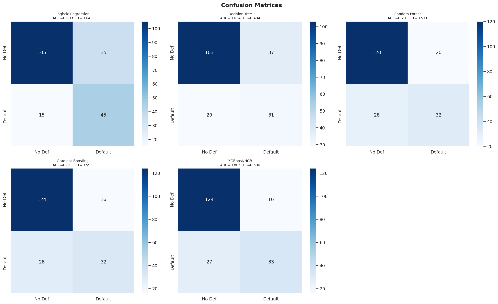
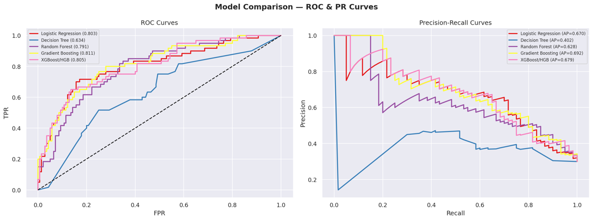
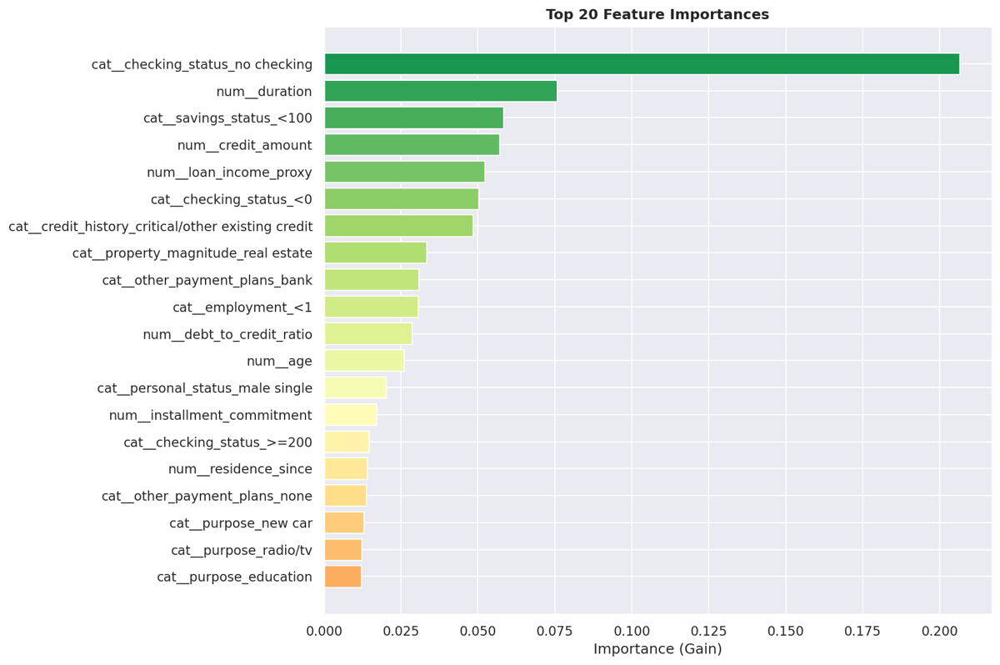
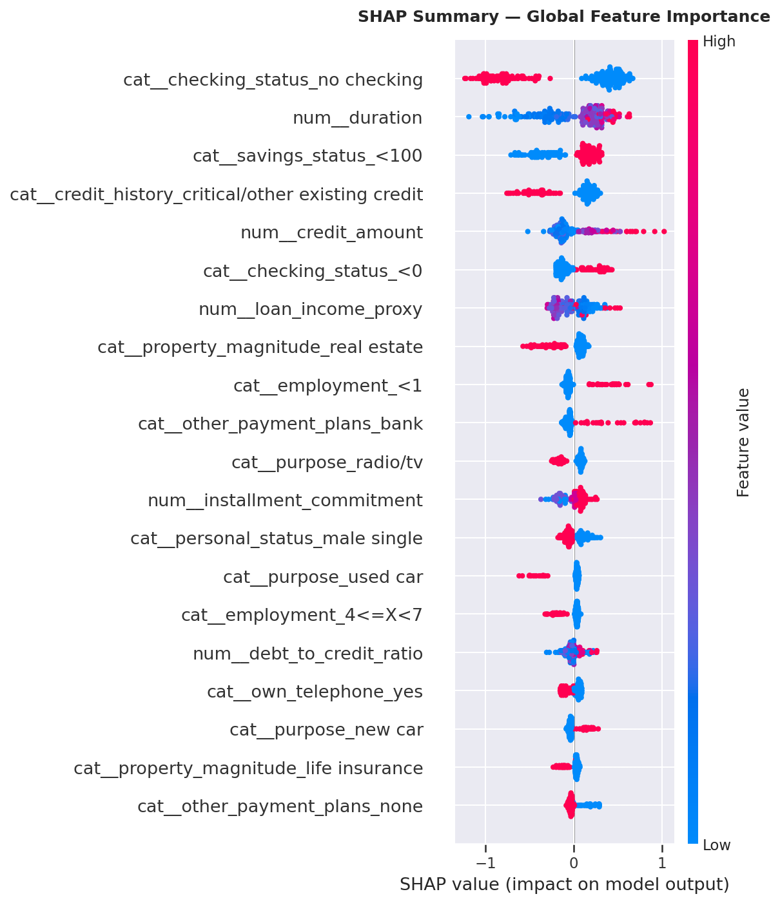
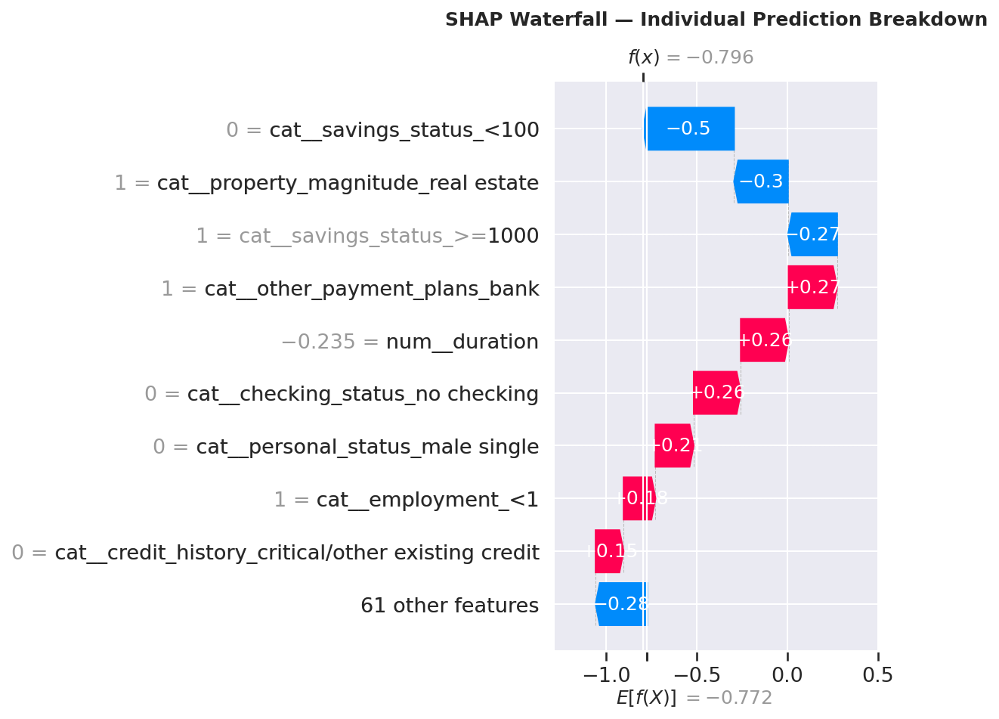

# 🏦 Loan Default Risk Assessment

   

 

**A live, deployed machine learning system for predicting loan default risk**, trained on the German Credit dataset with SMOTE class balancing and a business-cost-optimized decision threshold, served via a REST API and an interactive dashboard.

> All metrics on this page are from a single reproducible training run. No placeholder or template figures.

---

## 📌 Table of Contents

- [Live Deployments](#-live-deployments)
- [Overview](#-overview)
- [Model Performance](#-model-performance)
- [Visualizations](#️-visualizations)
- [Tech Stack](#️-tech-stack)
- [Project Structure](#-project-structure)
- [Local Setup](#️-local-setup)
- [API Reference](#-api-reference)
- [Business Framing](#-business-framing)
- [Author](#-author)
- [License](#-license)

---

## 🔴 Live Deployments

| Service | URL | Status |
|---|---|---|
| **Prediction API** | [loan-risk-assessment-nsdw.onrender.com](https://loan-risk-assessment-nsdw.onrender.com) | ✅ Live — Flask + gunicorn on Render |
| **Health Check** | [/health](https://loan-risk-assessment-nsdw.onrender.com/health) | ✅ `{"status": "ok"}` confirmed |
| **Dashboard** | [jameskoero-loan-risk-assessment-h84.vercel.app](https://jameskoero-loan-risk-assessment-h84.vercel.app/) | ✅ Live — static HTML/JS on Vercel |

> ⚠️ The API runs on Render's free tier — the first request after idle may take 30–60s to cold-start.

---

## 🌍 Overview

This repository trains and serves a `GradientBoostingClassifier` that predicts loan default probability from the German Credit dataset (OpenML id=31, 1,000 applicants, 20 features). SMOTE is applied to correct the dataset's 70/30 class imbalance, and the decision threshold is selected via a business cost matrix rather than the naive 0.5 cutoff.

| Output | Description |
|---|---|
| ⚡ **Prediction API** | Flask endpoint — submit applicant data, receive a risk score in one request |
| 📊 **Interactive Dashboard** | Full applicant form with dropdowns for every German Credit field, live-connected to the API |
| 🔍 **Cost-optimized threshold** | Business-tunable false-negative/false-positive cost matrix, not a fixed 0.5 cutoff |

---

## 📊 Model Performance

> Model: **GradientBoostingClassifier**, GridSearchCV-tuned, trained on SMOTE-balanced folds.

| Metric | Score | Notes |
|---|---|---|
| **CV ROC-AUC** (5-fold) | **0.916** | On SMOTE-balanced training folds |
| **Test ROC-AUC** (held-out 20%) | **0.791** | Real-world generalization estimate |
| **Gini Coefficient** | **0.582** | = 2×AUC−1; Basel III minimum acceptable is 0.35 |
| **Optimal threshold** | **0.22** | Selected via cost matrix (false-negative penalty 5×, false-positive penalty 1×) |
| **F1 at default 0.5 threshold** | 0.632 | If deployed without cost-based tuning |
| **Precision at 0.22 threshold** | 0.45 | Of applicants flagged high-risk, 45% actually default |
| **Recall at 0.22 threshold** | 0.833 | Catches 83.3% of real defaulters |
| **F1 at 0.22 threshold** | 0.585 | Deployed operating point |

**Best hyperparameters:** `learning_rate=0.05, max_depth=4, n_estimators=100, subsample=0.8`

**Why precision is lower at the deployed threshold:** the cost matrix (COST_FN=5, COST_FP=1) is deliberately conservative — missing a real defaulter is weighted 5× worse than wrongly flagging a good applicant.

---

## 🖼️ Visualizations

> Regenerated directly from the current SMOTE-corrected model — matches the metrics table above exactly.

### Confusion Matrix

### ROC Curve

### Feature Importance

### SHAP Summary — Global Feature Impact

### SHAP Waterfall — Individual Prediction

---

## 🛠️ Tech Stack

| Component | Tool |
|---|---|
| Language | Python 3.11 |
| Machine Learning | scikit-learn 1.6.1, GradientBoostingClassifier |
| Imbalance handling | imbalanced-learn 0.14.2 (SMOTE) |
| API | Flask 3.1.3, gunicorn 23.0.0 |
| Frontend | Static HTML/JS, zero build step |
| Backend hosting | Render |
| Frontend hosting | Vercel |
| Training environment | Google Colab |

---

## 📁 Project Structure
